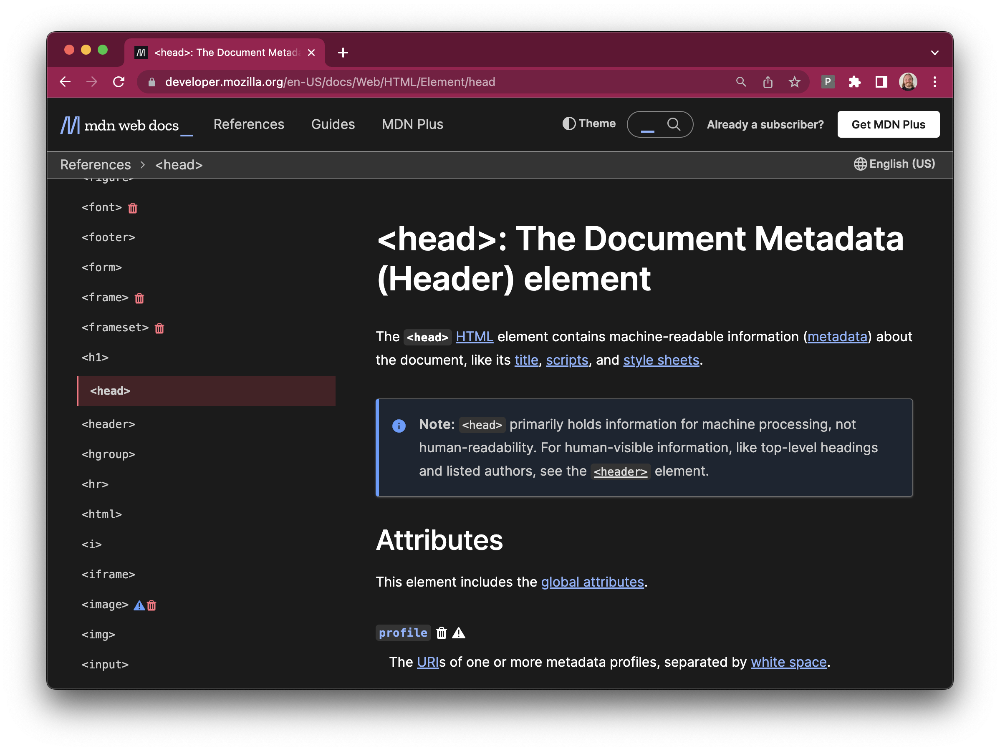
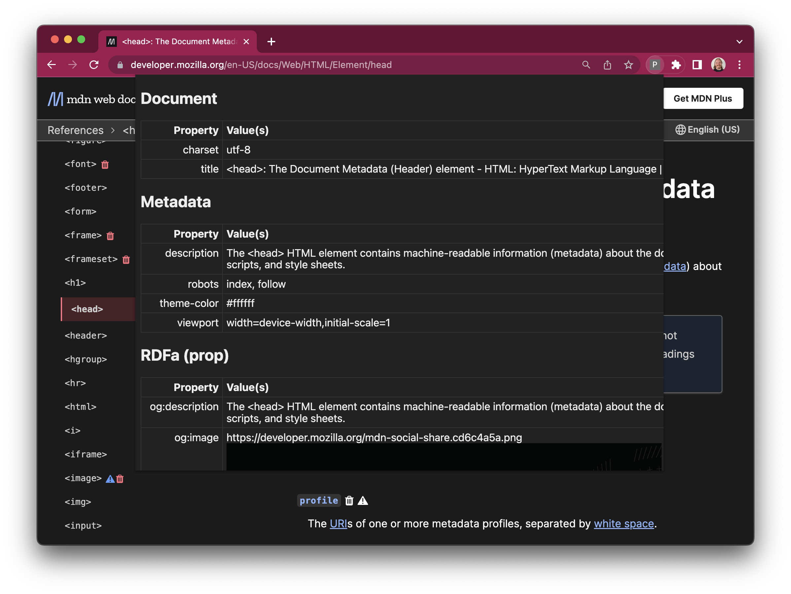
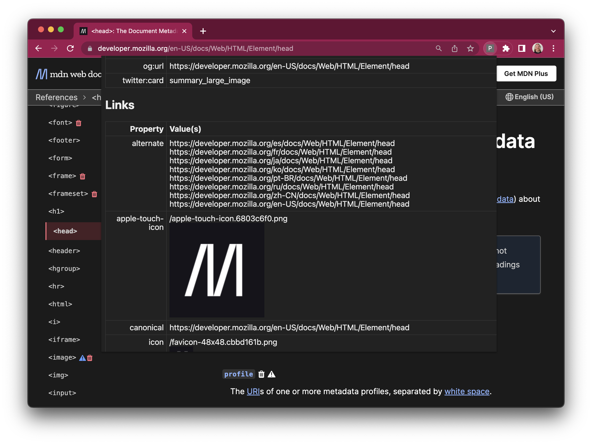

Pith Helmet
===========

I wrote this small Chrome extension to help me inspect other
websites <tt>&lt;HEAD&gt;</tt> elements, searching for real-world
use cases for things like [Schema.org][1] and [Open Graph][2].

[1]: https://schema.org/
[2]: https://ogp.me/

Once enabled, it injects a small harvester script into each page
you visit.  This harvester extracts document metadata from the
head of the HTML document, and communicates it to the front-end
browser extension for display.

It looks like this:

Pith Helmet also detects referenced images, used in places like
`og:image` meta tags and `apple-touch-icon` link tags:

